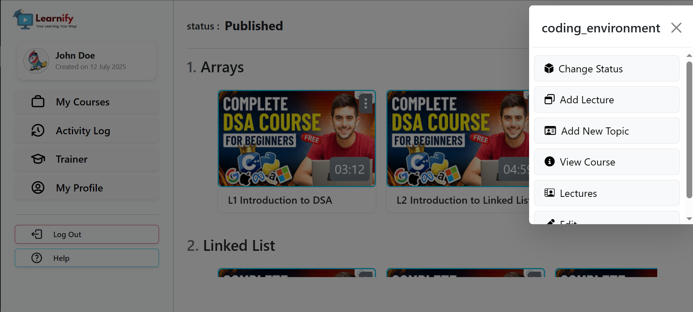

<div align="center">
  <h1>LEARNIFY</h1>
  <strong>Full Stack Web Application</strong>

  <!-- YouTube playlist link -->
  <p style="margin-top:12px;">
    <a
      href="https://youtube.com/playlist?list=PLiNFN8vks66rgDw0SLXS0M8YJyzZRDqY3&si=mopv9eEN3b9csSvy"
      target="_blank"
      rel="noopener noreferrer"
      style="display:inline-block; margin-top:8px; padding:8px 14px; border-radius:6px; text-decoration:none; border:1px solid #333;"
    >
      Watch the Learnify playlist on YouTube
    </a>
  </p>

</div>


---

##  About the Project

Learnify is a **full-stack Java web application** for online learning.  
It allows students to **purchase, enroll, and track courses** while providing trainers with **dashboards to manage content efficiently**.

**Key Highlights:**

- Developed with **JSP/Servlets** + **JDBC** + **MySQL** for secure data handling.
- Dynamic content delivery for scalable user interactions.
- RESTful API integration for modular architecture.
- Trainer dashboards to monitor courses and users.

---

##  Features

- User registration & authentication
- Role-based access (Admin / Instructor / Student)
- Course management: create, update, delete
- Profile management (images, progress tracking)
- Interactive dashboards
- Dynamic content delivery
- RESTful API integration

---

##  Screenshots

Here are some screenshots of the website:

| Screenshot | Description |
|------------|-------------|
|  | Home Page |
|  | Sign In & Register |
|  | Courses Section |
|  | Particular Course (for Purchase) |
|  | Course Preview (with Purchase Button) |
|  | Profile Section |
|  | Trainer Section (Upload & Sell Courses) |
|  | View Trainer Courses (Edit) |


---

##  Tech Stack

| Layer      | Technology                                  |
| ---------- | ------------------------------------------- |
| Backend    | Java, JSP, Servlets, JDBC, MySQL , EL, JSTL |
| Frontend   | HTML, CSS, JavaScript, AJAX, Bootstrap      |
| Build Tool | Advanced Java Folder Structure              |
| Deployment | Render                                      |

---

##  Folder Structure

```
Root Folder (App)/
├── static/
│    ├── css/
│    │    └── * All CSS files *
│    ├── js/
│    │    └── * All JS files *
│    └── media/
│         ├── images/
│         │    └── * All images *
│         └── videos/
│              └── * All videos *
├── WEB-INF/
│    ├── src/
│    │    ├── controllers/
│    │    │    └── * Java controller classes *
│    │    ├── filters/
│    │    │    └── * Java filter classes *
│    │    ├── models/
│    │    │    └── * Java model classes *
│    │    ├── utils/
│    │    │    └── * Java utility classes *
│    │    └── listeners/
│    │         └── * Java listener classes *
│    ├── lib/
│    │    └── * All required JAR libraries *
│    ├── pages/
│    │    └── * All JSP files *
│    └── uploads/
│         └── * User-specific folders (named by email) containing user data *
├── queries.db
│    └── * SQLite database file for creating tables and sample data *
└── readme-image/
     └── * All images used in README files *

```

---

<!-- ##  User Data Storage

After registration, each user gets a dedicated folder under `APPLICATION_USERS`.  
This folder stores all important user-specific data:

- Course videos
- Profile images
- Other content

> Each folder is named after the username for organized and secure storage. -->

---

#  How To Run

## Steps to Run This Application

1. **Install Apache Tomcat Server**
   - Download and install **Apache Tomcat** (preferably version 9 or above).
   - Set up the Tomcat environment variables (`CATALINA_HOME` and `JAVA_HOME`) properly.

---

2. **Clone the GitHub Repository**

```bash
git clone https://github.com/malviyanayan/Learnify_E_Learning_Plateform.git
```

3. **Move the Project Folder to Tomcat Webapps Directory**

```bash
move Learnify_E_Learning_Plateform "C:\apache-tomcat-9.0.85\webapps\"
This places your project inside the Tomcat webapps folder so it can be deployed automatically when the server starts.
```

4. **Setup Database**
   - Open the `queries.db` file in any text editor.
   - Copy all the SQL queries and run them in your MySQL command line to create the required database and tables.

<!-- ````bash
mysql -u root -p
mysql> source path/to/queries.db;
```` -->

5. **Configure Database Connection**
   - Go to `WEB-INF/src/utils/Database.java`.
   - Update your MySQL username and password in the connection code.
```java
private static final String USER = "your_mysql_username";
private static final String PASSWORD = "your_mysql_password";
```

6. **(Optional) Configure Email Sending Feature**  
   - To enable email sending (for OTPs, notifications, etc.). 
   - You can Edit this According to your need. 

```text
WEB-INF/src/utils/Email.java
Update your sender email address and the 12-character app password (generated from your email provider).

Example (Gmail users): create an App Password and paste it into the code.
```

7. **Compile Java Code**
   - Open the `WEB-INF/src` directory in your command line and run the following command to compile all Java files:
```bash
javac -cp ".;../lib/*" -d ../classes controllers/*.java models/*.java utils/*.java listeners/*.java
```

8. **Run the Application**
   - Start your Tomcat server:
```bash
cd /path/to/tomcat/bin
startup.bat    # For Windows
./startup.sh   # For Linux/Mac
```

9. **Access the Application Dashboard**
   - Once the server is running, go to your browser and open:
```text
http://localhost:8080/Learnify_E_Learning_Plateform
```
